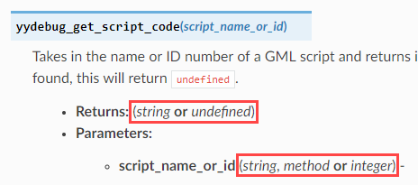

Type Documentation
==================

This quick guide serves as a reference for how parameter/return types are documented in the API Reference.

Motivation
^^^^^^^^^^

GML is a dynamically-typed language. It does not support nominally-typed classes, often uses ID
numbers to represent objects and certain data structures, and has functions that can accept more than one
type of data. Because of this, it can be confusing knowing what type of data certain variables contain, or
what is accepted/returned by certain functions. This document attempts to alleviate that by enforcing
a particular standard when describing the data types of the functions detailed in the API Reference.

Generally speaking, the type terms have been chosen carefully such that it should be easy enough to
understand what is expected of the API without even needing this guide. However, in the event that the documented
type is unclear or creates confusion, this reference is here.

After reading this document, the goal is that you will be able to understand API type definitions like the following:

Without any ambiguity.

Without further ado, the following is a list of the type terms that will be used throughout the API Reference:

Type Reference
^^^^^^^^^^^^^^

any
***

Indicates any possible type. No restrictions whatsoever.

number
******

One of the simplest types to understand, the ``number`` type can be used to represent any real number, like ``1``, ``2``, ``-16.781``, or even ``infinity``.
In the context of our API Reference, it refers specifically to the datatype of any variable where ``typeof(var_name) == "number"``.

string
******

The ``string`` type represents textual data, such as ``"John"``, ``"Player 2"``, or ``"The quick brown fox."``. The text in question can contain letters, digits, spaces, punctuation, or even unicode characters such as symbols from non-Latin-based languages.
In the context of our API Reference, it refers specifically to the datatype of any variable where ``typeof(var_name) == "string"``.

bool
****

The ``bool`` type is a single bit of data that represents a ``true`` or a ``false``.
In the context of our API Reference, it refers specifically to the datatype of any variable where ``typeof(var_name) == "bool"``.

int32
*****

The ``int32`` type represents an integer within the range ``-2,147,483,648`` to ``2,147,483,647``.
In the context of our API Reference, it refers specifically to the datatype of any variable where ``typeof(var_name) == "int32"``.

int64
*****

The ``int64`` type represents an integer within the range ``-9,223,372,036,854,775,808`` to ``9,223,372,036,854,775,807``.
In the context of our API Reference, it refers specifically to the datatype of any variable where ``typeof(var_name) == "int64"``.

ptr
***

The ``ptr`` type represents a reference to a location in physical memory, usually as a 32-bit or 64-bit integer.
In the context of our API Reference, it refers specifically to the datatype of any variable where ``typeof(var_name) == "ptr"``.

undefined
*********

The ``undefined`` type is a `unit type <https://en.wikipedia.org/wiki/Unit_type>`_, whose value indicates that something is erroneous or invalid.
In the context of our API Reference, it refers specifically to the datatype of any variable where ``typeof(var_name) == "undefined"`` (and thus, ``var_name == undefined``).

vec3
****

The ``vec3`` type represents a static array of size 3, specifically used for GLSL Shaders.
In the context of our API Reference, it refers specifically to the datatype of any variable where ``typeof(var_name) == "vec3"``.

vec4
****

The ``vec4`` type represents a static array of size 4, specifically used for GLSL Shaders.
In the context of our API Reference, it refers specifically to the datatype of any variable where ``typeof(var_name) == "vec4"``.

method
******

The ``method`` type represents a reference to a GML function. Despite its name, it does not necessarily refer to the concept of a `method <https://en.wikipedia.org/wiki/Method_(computer_programming)>`_ from object-oriented programming (although it can).
In the context of our API Reference, it refers specifically to the datatype of any variable where ``typeof(var_name) == "method"``.

struct
******

The ``struct`` type represents a reference to a GML struct/lightweight object. Because structs can contain a wide variety of information, this will usually be followed by a brief documentation of all of the struct's members.
In the context of our API Reference, it refers specifically to the datatype of any variable where ``typeof(var_name) == "struct"``.

array
*****

The ``array`` type represents a collection of items stored contiguously in memory.
In the context of our API Reference, it refers specifically to the datatype of any variable where ``typeof(var_name) == "array"``.

array[any]
**********

An array of any type. Equivalent to the above.

array[*type* **or** *types*]
****************************

An array containing elements of the specified *type* or *types*.

integer_number
**************

Any value of type ``number`` that represents an integer. Essentially, that means ``typeof(var_name) == "number"`` **and** ``var_name == floor(var_name)``.

integer
*******

Indicates that the underlying type can be ``int32``, ``int64``, or ``integer_number``.

boolean_number
**************

Any value of type ``number`` that represents a boolean (1 or 0). This is what most Game Maker "booleans" actually are for legacy reasons (despite there being a separate ``bool`` data type). Our API Reference makes a distinction between the two for the sake of accuracy and to avoid confusion (it would be inaccurate to say that a function accepts a ``bool`` when in reality it accepts a ``number`` which represents a **boolean**)

boolean
*******

Indicates that the underlying type can be ``bool`` or ``boolean_number``. For most API functions that accept or return true/false values, this is the type that will be specified.

object_id
*********

function_id
***********

asset_id
********

ds_list_id
**********

ds_list_id[*type* **or** *types*]
*********************************

ds_map_id
**********

ds_map_id[(*keytype* **or** *keytypes*), (*valtype* **or** *valtypes*)]
***********************************************************************

ds_grid_id
**********

ds_grid_id[*type* **or** *types*]
*********************************

ds_stack_id
***********

ds_stack_id[*type* **or** *types*]
**********************************

ds_queue_id
***********

ds_queue_id[*type* **or** *types*]
**********************************

ds_priority_id
**************

ds_priority_id[*type* **or** *types*]
*************************************
